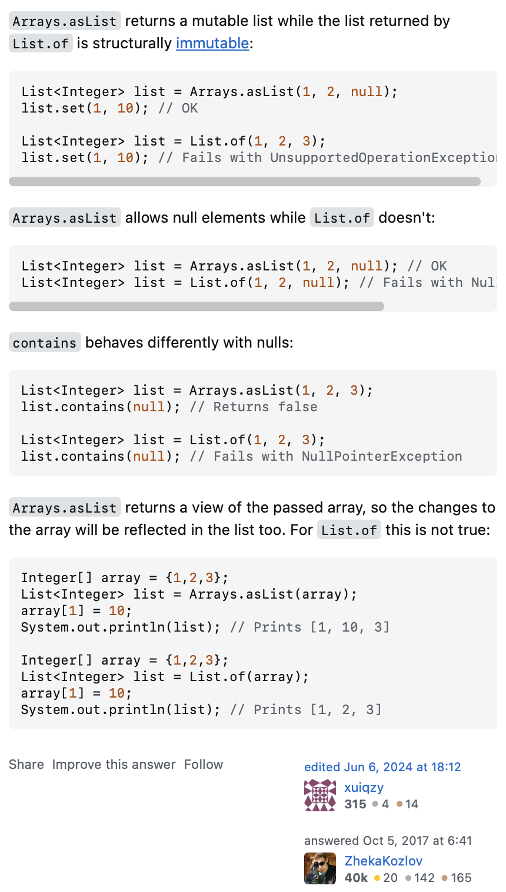

# Collections
- All types of collections extends from the `Collection` interface in Java, except for `Map`.
- All collections are generic types.

## `Collection` interface
- The root interface in the collection hierarchy.
- Extends `Iterable` interface.
- Defines basic methods for adding, removing, and checking elements in a collection.
- Commonly used subinterfaces:
    - `List`: An ordered collection (also known as a sequence) that allows duplicate elements.
    - `Set`: A collection that does not allow duplicate elements.
    - `Queue`: A collection designed for holding elements prior to processing, typically in a FIFO manner.
    - `Deque`: A double-ended queue that allows insertion and removal of elements from both ends.
- For `add`, some implementations may throw `UnsupportedOperationException` if the collection is unmodifiable.

## `equals()`
- Reflexivity: For any non-null reference value `x`, `x.equals(x)` should return `true`.
- Symmetry: For any non-null reference values `x` and `y`, `x.equals(y)` should return `true` if and only if `y.equals(x)` returns `true`.
- Transitivity: For any non-null reference values `x`, `y`, and `z`, if `x.equals(y)` returns `true` and `y.equals(z)` returns `true`, then `x.equals(z)` should return `true`.
- Consistency: For any non-null reference values `x` and `y`, multiple invocations of `x.equals(y)` should consistently return `true` or consistently return `false`, provided no information used in `equals` comparisons on the objects is modified.
- Non-nullity: For any non-null reference value `x`, `x.equals(null)` should return `false`.
- For properties equality checking of the object, they need not satisfy non-nullity if certain properties can be null.
- Example:
```java
@Override
public boolean equals(Object obj) {
    if (this == obj) return true;
    if (obj == null || getClass() != obj.getClass()) return false;
    MyClass other = (MyClass) obj;
    return Objects.equals(this.property1, other.property1) &&
            this.id == other.id;
}
```
- By default, any `Object` uses reference equality (i.e., `==` operator) for `equals()` method.

## `hashCode()`
- Consistency: The `hashCode` method must consistently return the same integer value, provided that the object is not modified in a way that affects `equals` comparisons.  
  This must hold:
> a.equals(b) == true → a.hashCode() == b.hashCode()
- Unequal objects can have the same hash code, but the reverse is not true. Because hash collisions can occur when different objects produce the same hash code.  
  This does ***not*** necessarily hold:
> a.hashCode() == b.hashCode() → a.equals(b) == true  

So collections like HashMap or HashSet rely on:
1. hashCode() → group objects into buckets
2. equals() → precisely check whether two objects are equal inside the bucket.

- By default, The Object.hashCode() method is a native method, which returns distinct integers for distinct objects. 
(This is typically implemented by converting the internal address of the object into an integer, 
but this implementation technique is not required by the JavaTM programming language.)
  
- `Objects` class provides hashing utility methods:

    - `Objects.hash(Object... values)`: 
  
      - Generates a hash code for a sequence of input values.
      - Uses Arrays.hashCode(Object[] a) internally, which implements in the same way as `List.hashCode()`.
      ```java
      int hashCode = 1;
      for (E e : list)
        hashCode = 31 * hashCode + (e == null ? 0 : e.hashCode());
      ```
      
    - `Objects.hashCode(Object o)`: 
      - Returns the hash code of the given object, or 0 if the object is null.
      - Calls `o.hashCode()` under the hood if `o` is not null.

## `Comparable<T>`
- An interface that defines a natural ordering for objects of a class.
- Contains the method `compareTo(T o)`, which compares the current object with the specified object.
- The `compareTo` method returns:
    - A negative integer if the current object is less than the specified object.
    - Zero if the current object is equal to the specified object.
    - A positive integer if the current object is greater than the specified object.
- Classes that implement `Comparable` can be sorted using sorting algorithms or data structures that rely on natural ordering (e.g., `TreeSet`, `TreeMap`).
- Example:
```java
public class MyClass implements Comparable<MyClass> {
    private int value;
    public MyClass(int value) {
        this.value = value;
    }
    @Override
    public int compareTo(MyClass other) {
        return Integer.compare(this.value, other.value);
    }
}
```

## `Comparator<T>`
- An interface that defines a custom ordering for objects of a class.
- Contains the method `compare(T o1, T o2)`, which compares two objects.
- The `compare` method returns the same results as `compareTo`.
- `Comparator` can be used to define multiple orderings for a class, unlike `Comparable`, which defines a single natural ordering.
- Example:
```java
public class MyClassComparator implements Comparator<MyClass> {
    @Override
    public int compare(MyClass o1, MyClass o2) {
        return Integer.compare(o1.getValue(), o2.getValue());
    }
}
```

## `Iterable<T>` interface
- The root interface for all iterable collections in Java.
- Defines the method `iterator()`, which returns an `Iterator` over elements of type `T`.
- Allows the use of enhanced for-loops (for-each loops) to iterate over collections.
```java
for (T element : collection) {
    System.out.println(element);
}
```
- **fail-fast iterator**: 
    - If the collection is modified structurally, e.g., adding or removing elements, *after* the iterator is created, 
    the iterator will throw a `ConcurrentModificationException` on the next `iterator.next()` on a best-effort basis.
    - This behavior comes from the `modCount` field in collection implementations, an internal modification counter.

## `List<T>`
- An ordered collection (also known as a sequence)
- Allows duplicate elements.
- Typically allows multiple null elements if allows null elements at all.
- Common implementations: `ArrayList`, `LinkedList`, `Vector`, `Stack`, `CopyOnWriteArrayList`.
- Supports bidirectional iteration.
- Methods:
    - `add(int index, T element)`: Inserts the specified element at the specified position, *shifts all the subsequent elements to the right8.
    - `remove(int index)`: Removes the element at the specified position, *shifts any subsequent elements to the left*.
    - `indexOf(Object o)`: Returns the index of the first occurrence of the specified element, or -1 if not found.

### `ArrayList<T>`
- A resizable array implementation of the `List` interface.
- Used an array under the hood.
- Provides $O(1)$ time complexity for add, get, set, etc. on general. 
- Provides amortized constant time complexity for `add(T element)` operation.

### `LinkedList<T>`
- A doubly-linked list implementation of the `List` and `Deque` interfaces.
- Each element (node) contains a reference to the previous and next node.
- Provides $O(n)$ time complexity for add, get, set, etc. on general.
- Provides $O(1)$ for appending and removing at the end of the list,

### `Vector<T>`
- Exists since Java 1.0, before the introduction of the Collections Framework in Java 2 (Java 1.2).
- A synchronized (thread-safe) implementation of the `List` interface.
- Similar to `ArrayList`, but with synchronized methods.
- Generally slower than `ArrayList` due to synchronization overhead.
- For multi-threaded environments, consider using `Collections.synchronizedList()` or `CopyOnWriteArrayList` instead.

### `CopyOnWriteArrayList<T>`
- A thread-safe variant of `ArrayList`.
- **Copy-on-Write** Strategy: When any modifying operation (like add, set, or remove) occurs, a new copy of 
the underlying array is created. The modification is performed on this new copy, and then the internal 
reference to the array is updated to point to the new, modified copy. 
- Writings can be expensive, especially with large lists
- Read operations do not require any locking and operate on a stable, immutable array.
- Suitable for read-intensive scenarios: When a list is primarily read and rarely modified.

### `List<E>` creation from array
- Using `Arrays.asList()`:
```java
String[] array = {"A", "B", "C"};
List<String> list1 = Arrays.asList(array);
```
- The returned list is fixed-size and backed by the original array.
- Can do everything that an array *can* do and *cannot*.
- Any modifications made to the elements of the returned List will directly reflect in
  the original array, and vice versa.
- Permits null values within the array.
- ***Handles primitive arrays differently:***
  When used with an array of primitive types (e.g., `int[]`, `char[]`), Arrays.asList() treats
  the entire primitive array as a single element, creating a List containing only one element,
  which is the primitive array itself. To create a List of individual primitive values, you need
  to use wrapper classes (e.g., `Integer[]` instead of `int[]`).
```
    Arrays.asList(new int[]{1, 2, 3}); // This gives a List of one element: [{1, 2, 3}]
    Arrays.asList(new Integer[]{1, 2, 3}); // This gives a List of elements: [1, 2, 3]
```

- Using `List.of()` (Java 9+):
```java
String[] array = {"A", "B", "C"};
List<String> list2 = List.of(array);
```
- The returned list is a shallow, unmodifiable copy of the input array.

### `Arrays.asList()` vs `List.of()`
A practical summary of an answer in a [Stack Overflow thread](https://stackoverflow.com/questions/46579074/what-is-the-difference-between-list-of-and-arrays-aslist):

[//]: # ()


### `List<E>` creation from another collection

- Using `new ArrayList<>(Collection<? extends E> c)`:
```java
List<String> list3 = new ArrayList<>(list2);
```
- The returned list is a shallow, modifiable copy of the input list.

- Using `List.copyOf(Collection<? extends E> c)` (Java 10+):
```java
List<String> list4 = List.copyOf(list2);
```
- The returned list is a shallow, unmodifiable copy of the input list.

### `ListIterator<T>`
- An iterator for lists that allows bidirectional traversal.
- Extends the `Iterator<T>` interface.
- Introduces cursor concept to indicate the position between elements in the list.
  ```
                       Element(0)   Element(1)   Element(2)   ... Element(n-1)
  cursor positions:  ^            ^            ^            ^                  ^
  ```
- Provides additional element modification methods:
  - `void add(T e)`: Inserts the specified element into the list (optional operation). 
  The new element is inserted **immediately before** the implicit cursor: a subsequent call to next would be unaffected, and a subsequent call to previous would return the new element.
  ```
  Before add(T e):
                       Element(0)   Element(1)   Element(2)   ... Element(n-1)
  cursor positions:                            ^
  
  After add(T e):
                       Element(0)   Element(1)   [e]   Element(2)   ... Element(n-1)
  cursor positions:                                  ^                              
  ```
  - Why? To make sure that forward traversal is safe from infinite loop after an add() operation
  without needing extra handling.
  ```java
  ListIterator<String> iterator = list.listIterator();
  while (iterator.hasNext()) {
      String element = iterator.next();
      if (someCondition(element)) {
          iterator.add("newElement"); 
          // iterator.next(); // Don't need this extra handling, don't do it.
      }
  }
  ```
  
  
  - `void set(T e)`: Replaces the last element returned by next or previous with the specified element (optional operation).
    - Can only be called (albeit multiple times) if neither `remove()` nor `add(E)` have been called after the last call to next or previous.
    - Why? 
      - remove() can possibly empty the list, leaving nothing to set.
      - If *only one* add() is allowed after next()/previous(), it would be equivalent to set() itself, making it redundant.
      - After with multiple add()'s, an index of the target element to set is needed,
      impairing the simplicity of the iterator, since set() is probably designed in *iterator concept*, to modify 
      one element at a time along the traverse (at each next()/previous()).

  - `void remove()`: Removes from the list the last element that was returned by next or previous (optional operation).
  
    - Can only be called once per next or previous. 
    - Why? To remove something, we must make sure that there is actually something there. Allowing calling multiple times until 
      the list is empty does not make sense since the iterator already offers `hasNext()` that signal the end of traverse.
    
    - It can be made only if add(E) has not been called after the last call to next or previous.
    - Why? It would complicate the design of the iterator, since after an add(), more variations of remove() are needed
    to accommodate the desired number of indexes of elements to remove, breaking the *iterator concept* of simplicity.
  